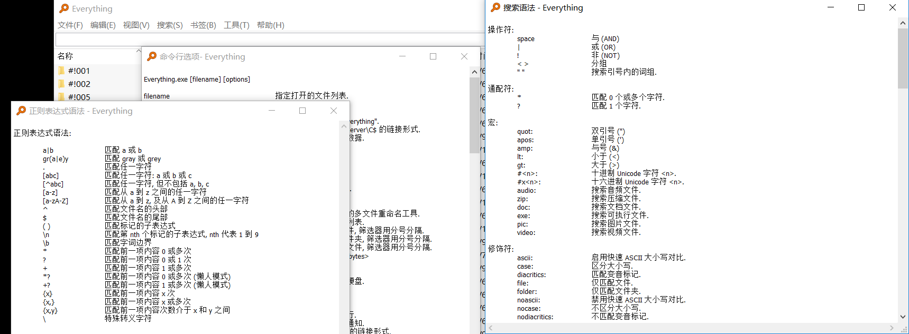

# Window小工具

一些我平时使用的工具类软件，确实对日常使用Windows很有帮助，都是免费的，部分是开源项目。

## 0、目录

- #### 截图&贴图 [Snipaste](https://zh.snipaste.com/) 

- #### 文件搜索 [Everything](https://www.voidtools.com/)

- #### Launcher [Wox](http://www.wox.one/)

- #### 文件预览 [QuickLook](https://pooi.moe/QuickLook/)

- #### 桌面美化&状态监控 [Rainmeter](https://www.rainmeter.net/)

- #### 快速录屏生成GIF [ScreenToGif](https://www.screentogif.com/?l=zh_cn)

## 1、Snipaste

这是一个简单但是强大的截图贴图工具(比如这里面的图片都是使用这个工具截的)，后台运行几乎不占用资源，使用快捷键触发(可以自定义)，快速截图以后可以直接在截图界面做一些标注、涂鸦，可以添加箭头、文字、几何形状，甚至马赛克。

[官网](https://zh.snipaste.com/)和[微软商店](https://www.microsoft.com/zh-cn/p/snipaste/9p1wxpkb68kx?ocid=badge&rtc=1#activetab=pivot:overviewtab) 都提供了 这个工具的下载，官网同样有MAC版本，Windows版本下载后直接解压使用。

## 2、Everything

[Everything](https://www.voidtools.com/)应该是目前Windows平台上最好的文件搜索工具，快速准确，比windows自己的资源管理器的搜索好太多了。

支持正则表达式和特殊语法搜索，可以使用命令行打开。

开机后的第一次启动由于建立文件索引，花费时间稍长。

还有一点就是不支持快捷键启动，但是可以配合[Wox](http://www.wox.one/)这个工具，可以发挥强大的效果。

## 3、Wox

一款强大的Launcher，支持各种插件，如计算器、翻译、网页搜索、文件搜索(将Everything作为插件)，可以修改启动热键，各种插件的触发关键字，支持主题修改和http代理。

界面简单，基本不占用资源。

把这个Launcher设置为开机启动，添加一个合适的启动热键(比我是用 Alt + Space)，结合使用其他插件简直效率翻倍。

项目开源，[Github](https://github.com/Wox-launcher/Wox)地址在这。

## 4、QuickLook

一个文件快速预览工具，启动以后对文件支持空格快速预览，常见文件格式都支持，Office文件和epub文件预览需要额外插件支持。

[Github](https://github.com/Wox-launcher/Wox)上有该项目源码和下载地址。

## 5、Rainmeter

一个界面美化工具，支持的桌面控件有时钟、搜索、硬件状态监控、网络状态监控，基于这些控件可以修改很多炫酷皮肤。（虽然我也就使用默认皮肤看自己硬件和网络...）

[官网](https://www.rainmeter.net/)上提供了社区入口，可以下载到很多玩家自制的美化皮肤，让桌面看起来不再那么单调。

[项目开源](https://github.com/rainmeter/rainmeter)。

## 6、ScreenToGif

小巧易用的一个快速录屏软件，可以对整个屏幕区域，或者摄像头，或者内置的画板实现快速生成GIF图，生成以后可以自动编辑GIF，十分强大，可以用来丰富自己的演示项目或说明性文件。

[软件开源](https://github.com/NickeManarin/ScreenToGif/)免费，没有任何广告。